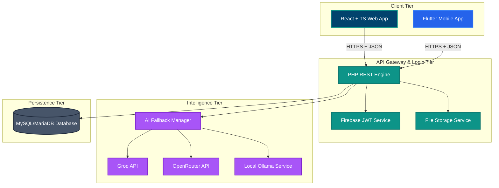
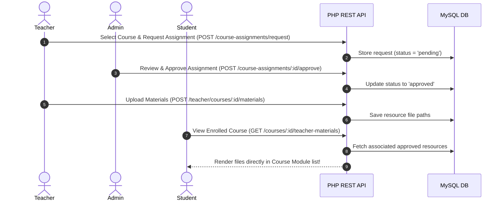

# BiT CareerGuide — Platform Status & System Architecture

This document provides a highly detailed, technical, and comprehensive review of the current status of the **BiT CareerGuide** platform. It describes the platform's multi-tier architecture, data structures, active endpoints, recent feature implementations, and deployment statuses across the web, backend, and mobile clients.

---

## 🚀 Executive Summary & Current Status

**BiT CareerGuide** is a custom-engineered career guidance ecosystem built for the **Bahir Dar Institute of Technology (BiT)** in Ethiopia. The platform is designed to close the gap between undergraduate academics and professional tech employment. It offers AI-guided custom roadmaps, curated institutional learning paths, direct teacher-to-student resource linkages, dynamic testing, and multi-portal monitoring.

### Key Metrics & Active Systems
* **Portals**: 4 functional web dashboard portals (Student, Teacher, Admin, BiT Academic Staff).
* **AI Provider Fallback**: A custom cURL-based chain (Groq Llama 3.3 ➔ OpenRouter Gemini 2.0 ➔ Local Ollama Llama 3) guaranteeing high uptime.
* **Mobile Client**: An active Flutter cross-platform mobile client wired directly to the backend REST API.
* **Newly Completed Integrations**:
  * **Dynamic On-Demand Lesson Generation**: Reworked AI Course Generation to construct modules/lesson outlines instantly (under 3s), generating and persistently caching full lesson contents on-the-fly when opened. This eliminates HTTP sequential timeouts and scales the platform's course generation to 100% reliability.
  * **Teacher Course-Specific Materials**: Connects teachers' resource uploads (videos, documents, slides) directly to course modules, immediately showing up in the student's specific course curriculum.
  * **Role-Based Onboarding & Registration**: Implements name validations and structured teacher background questionnaires (expertise areas, credentials).
  * **Landing Visual Overhaul**: Fully updated with dynamic typography (`Plus Jakarta Sans`), glassmorphism cards, and sleek interactive assets.

---

## 🛠️ Technical Stack Breakdown

The system relies on a lightweight, performant, and dependency-conscious technical architecture.



### 1. Web Frontend
* **Core Framework**: React 19.2.4 (Single Page Application architecture) with TypeScript 5.8.2.
* **Build System**: Vite 6.2.0 for hot-module reloading and high-efficiency tree-shaking production builds.
* **Styling**: Tailwind CSS 3.4.17 alongside custom Vanilla CSS glassmorphic definitions.
* **Key Packages**:
  * `lucide-react`: SVG icons.
  * `react-markdown`: Dynamic lesson blocks generated by the AI engines.
  * `date-fns`: Normalized client timelines.

### 2. Backend REST API
* **Runtime**: PHP 8.0+ running on XAMPP Apache or native environments.
* **Database Interface**: Pure PDO (PHP Data Objects) with raw SQL prepared statements to prevent SQL injections.
* **Dependencies**:
  * `firebase/php-jwt`: Decoupled token handling.
  * `vlucas/phpdotenv`: Strict environment separation.
* **Hosting**: Configured for local running via `php -S localhost:8000` (port 8000) or integrated Apache virtual routing on standard port 80.

### 3. Mobile App
* **Core SDK**: Flutter.
* **State Management**: Riverpod (for highly reactive and clean asynchronous data binding).
* **Network Client**: Dio with customized interceptors for JWT automatic injects and token refreshes.
* **Cross-Environment IP Routing**: Dynamically routes connections depending on local testing states (Web, Android Emulator `10.0.2.2`, or custom LAN IP values for debugging on physical Wi-Fi devices).

### 4. Artificial Intelligence Engines
* **Groq (Primary)**: Generates detailed structural paths and assessments via `llama-3.3-70b-versatile` with native JSON mode responses.
* **OpenRouter (Primary Backup)**: Employs `google/gemini-2.0-flash-001` to provide robust, large-context summaries.
* **Ollama (Offline/Local Fallback)**: Runs standard local `llama3` setups when internet access is constrained.

---

## 📁 Complete Workspace Architecture

Below is the updated physical file hierarchy of the active codebase:

```
careerguide/
├── backend/                             # Custom PHP REST API Engine
│   ├── app/
│   │   ├── Controllers/                 # HTTP Requests & Business Controllers
│   │   │   ├── AdminController.php      # User roles, approvals, platform moderations
│   │   │   ├── AIController.php         # Generates custom courses, paths & lessons
│   │   │   ├── AuthController.php       # Handles JWT token issuing and registration
│   │   │   ├── BitController.php        # Custom content creator actions for academic staff
│   │   │   ├── CourseAssignmentController.php # Teacher course assign flow
│   │   │   ├── ResourceController.php   # Resource and Course-Specific Material CRUD
│   │   │   ├── StudentMonitoringController.php # Tracks engagement indexes & risk statuses
│   │   │   └── ...
│   │   ├── Helpers/
│   │   │   └── JWTHelper.php            # Encapsulates Firebase/JWT operations
│   │   ├── Models/                      # PDO-Driven Query Models
│   │   │   ├── EducationalResource.php
│   │   │   ├── User.php
│   │   │   └── ...
│   │   └── Services/
│   │       └── AiService.php            # Handles provider fallback loop
│   ├── config/
│   │   └── database.php                 # Relational PDO Connection Initializer
│   ├── database/
│   │   └── schema.sql                   # Global Schema Definition & Seed Queries
│   ├── public/
│   │   └── index.php                    # Front Controller (Handles CORS and Routing Setup)
│   ├── routes/
│   │   └── api.php                      # Endpoint Pattern Matcher & Router
│   └── uploads/                         # Multipart uploaded directories
│
├── frontend/                            # React + TS Web Portal
│   ├── App.tsx                          # App Bootstrapper & Custom Client Router
│   ├── index.css                        # CSS Global Imports & Tailwind Config
│   ├── types.ts                         # Unified TypeScript Type Declarations
│   ├── components/
│   │   ├── Auth/
│   │   │   ├── EnhancedSignUpPage.tsx   # Progressive teacher/student registration
│   │   │   └── OnboardingPage.tsx       # Student career interest selectors
│   │   ├── Dashboard/
│   │   │   ├── DashboardRouter.tsx      # Dynamic role portal loader
│   │   │   ├── StudentDashboardLayout.tsx
│   │   │   ├── TeacherDashboardLayout.tsx
│   │   │   ├── AdminDashboardLayout.tsx
│   │   │   ├── TeacherResourcesView.tsx # Teacher file/video uploading dashboard
│   │   │   └── ...
│   │   └── Pages/
│   │       └── FAQPage.tsx
│   └── services/
│       └── apiClient.ts                 # Custom HTTP Request wrapper
│
├── mobile/                              # Cross-Platform Flutter App
│   ├── lib/
│   │   ├── core/
│   │   │   ├── constants/
│   │   │   │   └── api_constants.dart   # Port mapping configuration for physical devices
│   │   │   └── network/
│   │   │       └── api_client.dart      # Dio client definition
│   │   └── features/
│   │       └── student/
│   │           ├── providers/           # Riverpod state providers
│   │           └── screens/
│   │               ├── courses_screen.dart # Tabbed courses and enrollment screen
│   │               └── ...
```

---

## 🔑 Deep-Dive on Core Systems

### 1. Custom Teacher-to-Student Materials Pipeline
This newly completed workflow bridges direct teacher-managed academic files with the student's learning pathway:



* **Assignment Requests**: Teachers request which official courses they teach. The requests wait in the Admin queue. Once approved, the teacher gains permissions.
* **Materials Upload**: Approved teachers can upload files (PDFs, PPTX, MP4s, Word docs) up to **50MB** for their course.
* **Student Presentation**: When a student opens their standard course path, the backend merges the core curriculum with the teacher's active slides and lecture notes, letting them study the official path alongside the localized classroom materials.

### 2. Multi-Provider AI Fallback Engine
The system manages expensive API limits and connectivity challenges transparently:
1. **First Attempt (Groq)**: Fires `llama-3.3-70b-versatile`. High speed, free tier access.
2. **Second Attempt (OpenRouter)**: Triggers `google/gemini-2.0-flash-001` if Groq returns a rate limit (429) or gateway timeout (504).
3. **Third Attempt (Ollama)**: Connects to a locally running instance of `llama3` over the server's localhost loop.
4. **Structured Formatting**: The base provider uses a strict regex-based markdown wrapper (`cleanJson()`) to strip backticks and trailing symbols from output blocks before attempting dynamic JSON translation in PHP.

### 3. Progressive User Registrations & Security
* **Enhanced Signup Flow**: The platform separates students and teachers during account creation.
* **Input Cleaners**: The backend strictly validates the `name` parameter on `/auth/register` (demanding between 5 and 50 characters, at least two full words representing First and Family names, and blocking duplicate letter repeating sequences).
* **Teacher Verification Gate**: Teachers are stored as `account_status = 'pending'` and are completely restricted from operations until an administrator manually verifies their qualifications and academic history.

---

## 🗄️ Database Schema & Relational Structure

The relational schema coordinates content, roles, progress, and engagement:

```mermaid
erDiagram
    users ||--o{ course_enrollments : has
    users ||--o{ roadmaps : generates
    users ||--o{ educational_resources : uploads
    users ||--o{ assessment_attempts : attempts
    courses ||--o{ course_enrollments : receives
    courses ||--o{ assessments : has
    curated_roadmaps ||--o{ roadmap_enrollments : has
    assessments ||--o{ assessment_questions : contains
    assessments ||--o{ assessment_attempts : completes
    
    users {
        int id PK
        string name "5-50 chars, 2+ words"
        string email UNIQUE
        string password "bcrypt"
        enum role "student, teacher, admin, bit"
        enum account_status "active, pending, rejected"
        string academic_year
        int xp "experience credits"
        int streak
        string profile_image
    }

    courses {
        int id PK
        string title
        text description
        string category
        enum level "Beginner, Intermediate, Advanced"
        json modules "lessons data structure"
        string duration
        string author
        int created_by FK
    }

    course_enrollments {
        int id PK
        int user_id FK
        int course_id FK
        int progress "0-100%"
        json completed_lessons
        timestamp enrolled_at
    }

    educational_resources {
        int id PK
        string title
        text description
        enum resource_type "article, video, course, documentation, tutorial"
        string file_path "uploaded local path"
        string external_url
        int uploaded_by FK
        enum status "pending, approved, rejected"
        int views
    }

    assessments {
        int id PK
        int course_id FK
        string title
        text description
        int time_limit "minutes"
        int created_by FK
    }
```

---

## 📡 Complete REST API Endpoint Registry

Below is a tabular list of all endpoints available in the system router ([backend/routes/api.php](file:///c:/xampp/htdocs/careerguide/backend/routes/api.php)):

### 🔐 Authentication & Profile

| Method | Endpoint | Auth Required | Description |
|:---|:---|:---|:---|
| `POST` | `/api/auth/register` | No | Creates a new student or teacher (pending status) |
| `POST` | `/api/auth/login` | No | Authenticates credentials; returns token + user object |
| `POST` | `/api/auth/refresh-token` | Yes | Renews an expiring JWT token |
| `GET` | `/api/users/profile` | Yes | Retrieves the active user profile data |
| `PUT` | `/api/users/profile` | Yes | Modifies academic credentials and bio values |
| `POST` | `/api/users/profile/image` | Yes | Handles multipart file upload for profile photos |
| `GET` | `/api/users/stats` | Yes | Pulls student progress metrics (XP, current streak) |

### 🎓 Courses & Curated Paths

| Method | Endpoint | Auth Required | Description |
|:---|:---|:---|:---|
| `GET` | `/api/courses` | No | Retrieves all system courses |
| `GET` | `/api/courses/:id` | Optional | Gets a course, merging specific progress if authorized |
| `POST` | `/api/courses/generate` | Yes | Instructs the AI engine to generate a brand new course |
| `POST` | `/api/courses/:id/enroll` | Yes | Enrolls a student in a course |
| `DELETE` | `/api/courses/:id/unenroll` | Yes | Removes enrollment from a course |
| `PUT` | `/api/courses/:id/progress` | Yes | Saves completed lessons list and recalculates percent |
| `GET` | `/api/curated-roadmaps` | No | Returns published academic curricula |
| `GET` | `/api/curated-roadmaps/:id` | No | Details a single institutional curriculum |
| `POST` | `/api/curated-roadmaps/:id/enroll` | Yes | Auto-enrolls a student in all child curriculum courses |

### 📝 Teacher Course Materials & Assignments

| Method | Endpoint | Auth Required | Description |
|:---|:---|:---|:---|
| `POST` | `/api/course-assignments/request` | Yes (Teacher) | Files a request to assign a teacher to a specific course |
| `GET` | `/api/course-assignments/my` | Yes (Teacher) | Returns active assigned courses for the logged-in teacher |
| `GET` | `/api/course-assignments/approved` | Yes | Returns all approved system assignments |
| `GET` | `/api/teacher/courses/:id/materials` | Yes (Teacher) | Fetches resources uploaded by this teacher for a course |
| `POST` | `/api/teacher/courses/:id/materials` | Yes (Teacher) | Uploads course-specific slides/documents (up to 50MB) |
| `PUT` | `/api/teacher/materials/:id` | Yes (Teacher) | Updates title/metadata of a course material |
| `DELETE` | `/api/teacher/materials/:id` | Yes (Teacher) | Safely purges an uploaded file from disk and database |
| `GET` | `/api/courses/:id/teacher-materials` | Yes (Student) | Merges and retrieves the active teacher slides for a course |

### 🤖 Artificial Intelligence Services

| Method | Endpoint | Auth Required | Description |
|:---|:---|:---|:---|
| `POST` | `/api/ai/career-suggestion` | No | Advises on roles matching user text interests |
| `POST` | `/api/ai/career-details` | No | Pulls detailed salary charts and local tech requirements |
| `POST` | `/api/ai/lesson-content` | No | Asynchronously renders high-fidelity markdown lessons |
| `POST` | `/api/ai/generate-assessment` | No | Generates dynamic multiple-choice question arrays |

---

## 🛠️ Diagnostics & Setup Verification

### How to Run Locally

1. **Verify PHP Connection**:
   Ensure you have configured `backend/.env` with your DB details:
   ```ini
   DB_HOST=localhost
   DB_NAME=careerguide
   DB_USER=root
   DB_PASS=
   ```
2. **Start the API Server**:
   ```bash
   cd backend
   php -S localhost:8000 -t public
   ```
3. **Start the Web Client**:
   ```bash
   cd frontend
   npm run dev
   ```
4. **Start the Flutter App (Android Emulator)**:
   Ensure the `baseUrl` in `mobile/lib/core/constants/api_constants.dart` points to `http://10.0.2.2/careerguide/backend/api` or `http://10.0.2.2:8000/api`. Run:
   ```bash
   cd mobile
   flutter run
   ```

> [!NOTE]
> **Production Note on CORS**:
> For production deployment, update the `Access-Control-Allow-Origin` values inside [backend/public/index.php](file:///c:/xampp/htdocs/careerguide/backend/public/index.php) from `*` or `http://localhost:3000` to your secure production domain.

---

## 📈 Future System Recommendations

To further scale the platform, we recommend prioritizing these structural changes:
1. **Session Cookies**: Move authentication from HTML-accessible `localStorage` tokens to secure, encrypted `httpOnly` server-set cookies to eliminate potential XSS vectors.
2. **Real-time Notifications**: Replace the current 30-second API polling trigger in `NotificationBell.tsx` with a lightweight WebSocket server or Server-Sent Events (SSE) to lower background server memory footprints.
